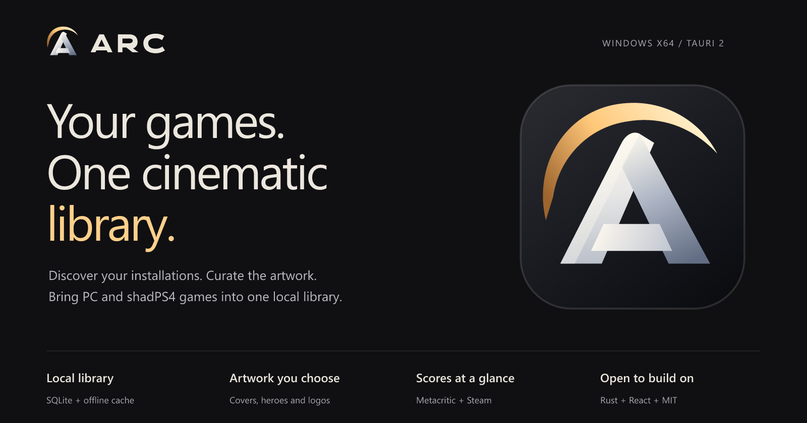
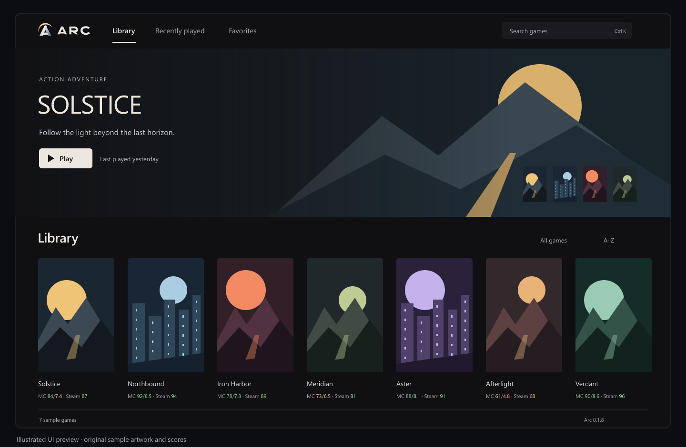
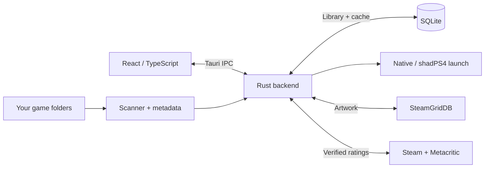

<p align="center">
  
</p>

<p align="center">
  <a href="https://github.com/ozaimoglu/arc/actions/workflows/windows.yml"></a>
  <a href="LICENSE"></a>
  <a href="https://github.com/ozaimoglu/arc/releases/tag/v0.1.8"></a>
  
</p>

<p align="center">
  <a href="https://github.com/ozaimoglu/arc/releases/download/v0.1.8/Arc_0.1.8_x64-setup.exe"><strong>Download for Windows</strong></a> ·
  <a href="https://github.com/ozaimoglu/arc/releases/tag/v0.1.8">Release notes</a> ·
  <a href="#build-from-source">Build from source</a> ·
  <a href="CONTRIBUTING.md">Contribute</a>
</p>

# Arc

Turn folders of installed games into a library worth opening. Arc brings cinematic artwork, critic and user ratings, and a direct Play action to your Windows desktop.

Built with **Tauri 2, Rust, React and SQLite**, Arc uses Windows WebView2 and keeps scanning, persistence and game launching in Rust. The current Windows installer is about **3.4 MiB**; WebView2 is provided by the system or installed separately by its bootstrapper.

## A library that feels like yours



*Illustrated preview with original sample artwork and scores. Your installed games and chosen artwork populate the actual app.*

| Feature | What you get |
| --- | --- |
| **Find your games** | Recursive folder discovery, Windows EXE metadata and confidence-based filtering of installers, crash handlers and support binaries. |
| **Put the artwork first** | Portrait covers, cinematic heroes and game logos. Choose alternatives through SteamGridDB or import local PNG/JPEG/WebP artwork. |
| **Know the scores** | One compact line: **MC 84/7.4 · Steam 87**. Critics, users and Steam positives keep their own scales, colors and source links. |
| **Keep it local** | Library, artwork cache, preferences and verified ratings persist locally in SQLite and remain available offline. |
| **Make it personal** | Favorites, recently played, search, sorting, grid/list views, editable titles, hide/restore and removal exclusions. |
| **Bring PS4 along** | Extracted PS4 game discovery by CUSA serial, existing shadPS4 launches and compatible Bloodborne BBLauncher setups. |
| **React to changes** | Debounced filesystem watching refreshes configured game folders. |
| **Own the code** | MIT licensed. A clear React/Rust boundary, migration-backed SQLite and regression tests. |

## Start playing

1. [Download the Windows x64 installer](https://github.com/ozaimoglu/arc/releases/download/v0.1.8/Arc_0.1.8_x64-setup.exe).
2. Open **Settings** and add your game folders.
3. Add an optional [SteamGridDB API key](https://www.steamgriddb.com/profile/preferences/api) for automatic artwork, or import your own images.
4. Scan, open a cover and choose **Play**.

The first desktop library starts empty. Automatic ratings require no API key or Chrome extension. Artwork credentials are encrypted with Windows DPAPI. Removing an entry only removes it from Arc; game files remain on disk.

**v0.1.8 is an early preview**, distributed as an unsigned NSIS installer. Windows x64 is the supported release target. Arc does not ship games, ROMs, firmware or an emulator.

## Scores without the clutter

`MC 84/7.4 · Steam 87` means **critics 84/100**, **users 7.4/10** and **87% positive Steam reviews**. A dash means unavailable; it is never a fabricated zero.

Details show the source, platform and scales. PS4 entries use PS4 Metacritic ratings. Steam results include all languages and purchase types, including off-topic reviews. Verified scores are cached for seven days and remain visible offline. Use **Refresh ratings** or **Correct game match** with a Steam URL/App ID when needed.

Matching/parsing logic is adapted from **CriticPeek**; Rust supplies bounded provider requests and SQLite storage. No Chrome runtime is required. See [rating architecture](docs/ARCHITECTURE.md#game-ratings) and [third-party notices](THIRD_PARTY_NOTICES.md).

## Built to be understood



| Layer | Stack |
| --- | --- |
| Desktop | Tauri 2 + Windows WebView2 |
| Interface | React + TypeScript + Vite + custom CSS |
| Native core | Rust, Windows APIs, walkdir, notify |
| Storage | SQLite + local artwork files |
| Packaging | NSIS; MSI can also be built from source |

The frontend launches by database game ID. Rust validates stored paths and arguments. Provider requests use fixed HTTPS boundaries; downloaded HTML is parsed as data. Normal startup reads SQLite instead of recursively scanning every installation.

[Architecture](docs/ARCHITECTURE.md) · [Design system](docs/DESIGN_SYSTEM.md) · [Brand assets](docs/BRANDING.md) · [Validation](docs/VALIDATION.md)

## Build from source

Install **Node.js 22+**, **stable Rust with the MSVC toolchain**, **Visual Studio C++ Build Tools** and **WebView2**. Follow the [Tauri Windows prerequisites](https://v2.tauri.app/start/prerequisites/).

```powershell
git clone https://github.com/ozaimoglu/arc.git
cd arc
npm ci
npm run desktop
```

For frontend work, run `npm run dev` and open the local preview printed by Vite. It includes eight sample games; scanning and launching require the desktop app.

### Check and package

```powershell
npm test
npm run build
python scripts/check-schema.py
cargo test --manifest-path src-tauri/Cargo.toml --locked
cargo clippy --manifest-path src-tauri/Cargo.toml --locked --all-targets -- -D warnings
npm run tauri -- build --bundles nsis
```

Install Clippy with `rustup component add clippy` if needed. Installers are written to `src-tauri/target/release/bundle/nsis/`. `npm run package:win` builds both NSIS and MSI. Windows CI checks the code and uploads a freshly built NSIS artifact.

## Roadmap

The first version focuses on local discovery, artwork, ratings and launching. The next useful contributions are:

- [ ] Steam, Epic, GOG and Xbox library imports
- [ ] Collections and richer library organization
- [ ] Controller navigation and a fullscreen library
- [ ] Descendant-process tracking and more accurate playtime
- [ ] Artwork cache pruning
- [ ] Broader emulator and ROM support

These are planned directions, not shipped features. Native game detection is heuristic; unusual installations may need a title edit or a matching fix. Session timing currently tracks the directly launched process.

## Help build Arc

Try an installation, report a reproducible bug, or send a focused PR. Scanner fixtures, rating-match regressions and keyboard improvements are useful places to start.

**[Contributing guide](CONTRIBUTING.md)** · **[Report a bug](https://github.com/ozaimoglu/arc/issues/new/choose)** · **[Propose a feature](https://github.com/ozaimoglu/arc/issues/new/choose)**

If Arc belongs in your game setup, star the repository and help shape the next release.

## License

[MIT](LICENSE) © 2026 Arc contributors. Dependencies, game artwork and provider content retain their respective rights. Arc is independent of Valve, Metacritic, SteamGridDB and shadPS4.
